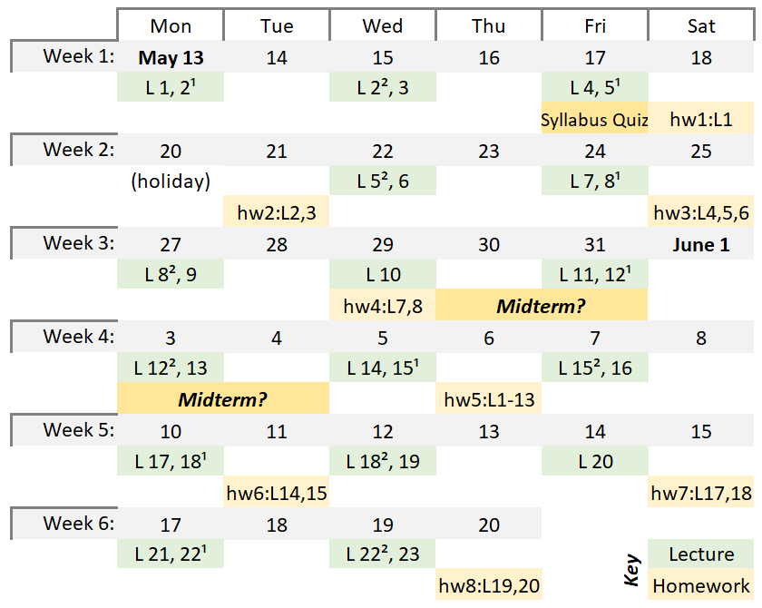

# UBC CPSC 330: Applied Machine Learning (2024s)

## Introduction
This is the course homepage for CPSC 330: Applied Machine Learning at the University of British Columbia. You are looking at the 2024S1 version, May-June 2024.

### Instructor
Mehrdad Oveisi
- moveisi@cs.ubc.ca
- [LinkedIn.com/in/oveisi](https://www.linkedin.com/in/oveisi/) (Feel free to connect on LinkedIn)
- [Google Scholar](https://scholar.google.com/citations?user=6l2ij0IAAAAJ)
- ***Office hours***:
  - **When:** Mon, Wed, Fri from 17:00 to 18:00 (as long as there are questions)
  - **Where:** 	[MCLD 2018](https://ssc.adm.ubc.ca/classroomservices/function/viewlocation?userEvent=ShowLocation&buildingID=MCLD&roomID=2018)
  - **Who:** Students form both sections are welcome to attend all office hours.
  - For **more details** see [class meetings on syllabus](https://github.com/UBC-CS/cpsc330-2024s/blob/main/syllabus.md#class-meetings).

### Class Schedule
| Section | Location | Day  | Lecture | Office Hour | OH Held By |
|:-:|-|-|-|-|-|
| 911 | [DMP 310](https://ssc.adm.ubc.ca/classroomservices/function/viewlocation?userEvent=ShowLocation&buildingID=DMP&roomID=310) | Mon, Wed, Fri | 10:00 - 13:00 | 13:00 - 14:00 | TAs |
| 912 | [MCLD 2018](https://ssc.adm.ubc.ca/classroomservices/function/viewlocation?userEvent=ShowLocation&buildingID=MCLD&roomID=2018) | Mon, Wed, Fri | 14:00 - 17:00 | 17:00 - 18:00 | TAs and Instructor |

- For **more details** see [class meetings on syllabus](https://github.com/UBC-CS/cpsc330-2024s/blob/main/syllabus.md#class-meetings).

### Course Coordinator
Liam Salt
- cpsc330-admin@cs.ubc.ca

Please email Liam Salt at the above email address for all administrative concerns such as CFA accommodations or exemptions due to sickness or extenuating circumstances.

### Teaching Assistants
- Please see [TAs on syllabus](https://github.com/UBC-CS/cpsc330-2023W1/blob/main/syllabus.md#tas).

## License
© 2023 Varada Kolhatkar and Mike Gelbart

Software licensed under [the MIT License](https://spdx.org/licenses/MIT.html), non-software content licensed under [the Creative Commons Attribution-NonCommercial-ShareAlike 4.0 International (CC BY-NC-SA 4.0) License](https://creativecommons.org/licenses/by-nc-sa/4.0/). See the [license file](LICENSE.md) for more information.

## Important links
* [Syllabus / administrative info](syllabus.md)
* [Calendar and due dates](https://github.com/UBC-CS/cpsc330-2024s/tree/main?tab=readme-ov-file#deliverable-due-dates-tentative)
* [Course videos YouTube channel](https://www.youtube.com/playlist?list=PLHofvQE1VlGtZoAULxcHb7lOsMved0CuM)
* [PrairieLearn](https://ca.prairielearn.com/pl/course_instance/7786) (course assessments)
* [Canvas](https://canvas.ubc.ca/courses/140666) (homework solutions, etc.)
* [Piazza](https://piazza.com/class/lvo65lmwh53527) (course **announcements** and discussions)
* [*Setting up coding environment*](https://github.com/UBC-CS/cpsc330-2024s/blob/main/docs/setup.md)
* [Other course documents](https://github.com/UBC-CS/cpsc330-2024s/tree/main/docs)
* [iClicker Cloud](https://github.com/UBC-CS/cpsc330-2024s/blob/main/syllabus.md#iclicker)

## Compact course schedule (tentative)
|IMPORTANT NOTE|
|---|
||
| As a general rule, summer terms are quite compact and thus time management is crucial to keep up with the course content and the deadlines. More precisely, based on the [university calendar](https://vancouver.calendar.ubc.ca/dates-and-deadlines), the number of *Teaching Days* is 63 in winter terms and it is 28 in summer terms. That means there will be 2.25 (63÷28) times more content to learn per week, and **2.25 times faster pace** for the homework due dates. In other words, you are expected to learn and deliver the same amount of work compared to winter terms, but do it 2.25 times faster! For this reason, ***time management is of utmost importance in order to succeed in the course***. |

 

The following chart is a very compact version of the course tentative schedule.

&nbsp;
 

The following sections provide for more detailed course schedule.
 

## Deliverable due dates (_**tentative**_)

|Assessment  | Due date |  Where to find? | Where to submit? |
|-|-|-|-|
| Syllabus quiz | May 17, 23:00  | [PrairieLearn](https://ca.prairielearn.com/pl/course_instance/7786) | PrairieLearn |
| hw1 | May 18, 23:00 |  [Github repo](https://github.com/UBC-CS/cpsc330-2024s/tree/main/hw/) | PrairieLearn |
| hw2 | May 21, 23:00 |   Github repo | PrairieLearn |
| hw3 | May 25, 23:00 |   Github repo | PrairieLearn |
| hw4 | May 29, 23:00 |   Github repo | PrairieLearn |
| **Midterm** | **[TBA]** **_Perhaps_** between  **_May 30_** to **_June 4_**  in _afternoon_ or _evening_ | PrairieLearn | PrairieLearn (in-person) |
| hw5 | June 06, 23:00 |   Github repo | PrairieLearn |
| hw6 | June 11, 23:00 |   Github repo | PrairieLearn |
| hw7 | June 15, 23:00 |   Github repo | PrairieLearn |
| hw8 | June 20, 23:00 |   Github repo | PrairieLearn |
| **Final exam** | **[TBA]** [Final exam schedule](https://students.ubc.ca/enrolment/exams/exam-schedule) | PrairieLearn | PrairieLearn (in-person) |

## Lecture schedule (tentative)

**Lectures**: 
- The lectures will be in-person (see *Class Schedule* above for more details).
- All lecture files are subject to change without notice up until they are covered in class.
- You are expected to watch the "Pre-watch" videos before each lecture.
- You are expected to attend the lectures.
- You will find the lecture notes under the [lectures](./lectures/mehrdad) in this repository. Lectures will be posted/updated as they become available.

| [Lectures](./lectures/mehrdad) | Date  | Topic | Assigned videos | vs. CPSC 340 |
|:-:|-|-|-|-|
|01 | May 13 | Course intro | 📹 <li>Pre-watch: None</li><li>Recap video (after lecture): [1.0](https://youtu.be/-1hTcS5ZE4w)</li> | n/a|
|  | | **Part I: ML fundamentals and preprocessing**  |
|02 | May 13 &amp; 15 | Decision trees | 📹 <li>Pre-watch: [2.1](https://youtu.be/YNT8n4cXu4A), [2.2](https://youtu.be/6eT5cLL-2Vc)</li> <li>After lecture: [2.3](https://youtu.be/Hcf19Ij35rA), [2.4](https://youtu.be/KEtsfXn4w2E)</li>  |   less depth|
|03 | May 15 | ML fundamentals | 📹  <li> Pre-watch: [3.1](https://youtu.be/iS2hsRRlc2M), [3.2](https://youtu.be/h2AEobwcUQw)</li> <li>After lecture: [3.3](https://youtu.be/4cv8VYonepA), [3.4](https://youtu.be/Ihay8yE5KTI)</li>| similar |
|04 | May 17 | $k$-NNs and SVM with RBF kernel | 📹  <li> Pre-watch: [4.1](https://youtu.be/hCa3EXEUmQk), [4.2](https://youtu.be/bENDqXKJLmg)</li> <li>After lecture: [4.3](https://youtu.be/IRGbqi5S9gQ), [4.4](https://youtu.be/ic_zqOhi020)</li>| less depth |
|05 | May 17 &amp; 22 | Preprocessing, `sklearn` pipelines | 📹  <li> Pre-watch: [5.1](https://youtu.be/xx9HlmzORRk), [5.2](https://youtu.be/G2IXbVzKlt8)</li><li>After lecture: [5.3](https://youtu.be/nWTce7WJSd4), [5.4](https://youtu.be/2mJ9rAhMMl0)</li> |  more depth|
|06 | May 22 | More preprocessing, `sklearn` `ColumnTransformer`, text features | 📹  <li> Pre-watch: [6.1](https://youtu.be/to2mukSyvLk), [6.2](https://youtu.be/hteVvLwrWZ4)</li>  | more depth |
|07 | May 24 | Linear models | 📹  <li> Pre-watch: [7.1](https://youtu.be/HXd1U2q4VFA), [7.2](https://youtu.be/56L5z_t22qE), [7.3](https://youtu.be/_OAK5KiGLg0)</li>  |   less depth |
|08 | May 24 &amp; 27 | Hyperparameter optimization, overfitting the validation set | 📹  <li> Pre-watch: [8.1](https://youtu.be/lMWdHZSZMk8),[8.2](https://youtu.be/Z9a9XZ0vQv0)</li>   |   different|
|09 | May 27 | Evaluation metrics for classification  | 📹  <li> Pre-watch: [9.2](https://youtu.be/ZCuCErW5lI8),[9.3](https://youtu.be/XkCTUuoH23c),[9.4](https://youtu.be/jHaKRCFb6Qw)</li>| more depth |
|10 | May 29 | Regression metrics | 📹 <li>Pre-watch: [10.1](https://youtu.be/lgGTKLwNgkQ)</li>|   more depth on metrics less depth on regression|
|11 | May 31 | Ensembles | 📹 <li>Pre-watch: [11.1](https://youtu.be/8litm1H7DLo),[11.2](https://youtu.be/EkFkY9QB2Hw)</li>   | similar |
|12 | May 31 &amp; Jun 3 | Feature importances, model interpretation | 📹 <li>Pre-watch: [12.1](https://youtu.be/xfICsGL7DXE),[12.2](https://youtu.be/tiSN18OmZOo)</li>   | feature importances is new, feature engineering is new |
|13 | Jun 3 |   Feature engineering and feature selection | None  | less depth |
| | **[TBA]** | **Midterm**  |  |
| |  | **Part II: Unsupervised learning, transfer learning, different learning settings**  ||
|14 | Jun 5 |   Clustering | 📹 <li>Pre-watch: [14.1](https://youtu.be/caAuUAXwpb8),[14.2](https://youtu.be/s6AvSZ1_l7I),[14.3](https://youtu.be/M5ilrhcL0oY)</li>   | less depth |
|15 | Jun 5 &amp; 7 |   More clustering | <li> Post-lecture: [15.1](https://youtu.be/1ZwITQyWpkY), [15.2](https://youtu.be/T4NLsrUaRtg), [15.3](https://youtu.be/NM8lFKFZ2IU)</li> | less depth |
|16 | Jun 7 |   Simple recommender systems |None | less depth ||
|17 | Jun 10 |  Text data, embeddings, topic modeling  | 📹 <li>Pre-watch: [16.1](https://youtu.be/GTC_iLPCjdY),[16.2](https://youtu.be/7W5Q8gzNPBc)</li>   |   new |
|18 | Jun 10 &amp; 12 | Neural networks and computer vision ||   less depth |
|19 | Jun 12 | Time series data | (Optional) [Humour: The Problem with Time & Timezones](https://www.youtube.com/watch?v=-5wpm-gesOY)| new |
|20 | Jun 14 | Survival analysis | 📹 (Optional but highly recommended) [Calling Bullshit 4.1: Right Censoring](https://www.youtube.com/watch?v=ITWQ5psx9Sw) |   new |
| | | **Part III: Communication, ethics, deployment**  ||
|21 | Jun 17  |  Ethics | 📹 (Optional but highly recommended) <li>[Calling BS videos](https://www.youtube.com/playlist?list=PLPnZfvKID1Sje5jWxt-4CSZD7bUI4gSPS) Chapter 5 (6 short videos, 50 min total)</li> <li>[The ethics of data science](http://jtleek.com/ads2020/week-15.html)</li>| new |
|22 | Jun 17 &amp; 19 | Communication | 📹 (Optional but highly recommended) <li>[Calling BS videos](https://www.youtube.com/playlist?list=PLPnZfvKID1Sje5jWxt-4CSZD7bUI4gSPS) Chapter 6 (6 short videos, 47 min total)</li> <li>[Can you read graphs? Because I can't.](https://www.youtube.com/watch?v=vbDObzI-CTc) by Sabrina (7 min)</li> |   new |
|23 | Jun 19 | Model deployment and Conclusions ||  new |
|24 |  | (optional reading) Stochastic Gradient Descent |  |   |
|25 |  | (optional reading) Combining Multiple Tables |  |   |
